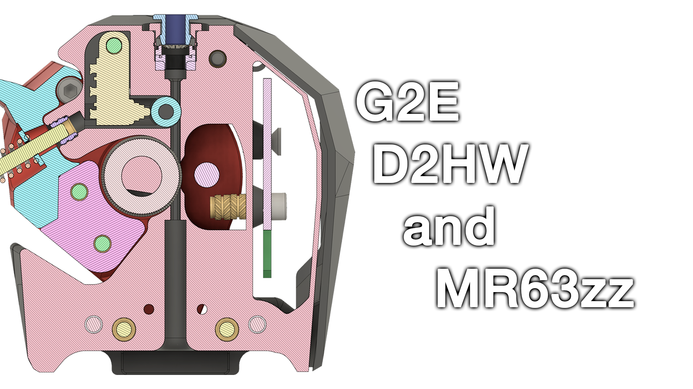

### Galileo 2 Remix with Pre-Extruder Gear Filament Sensor

#### Description:
This is a remix of the [**Galileo 2 extruder**](https://github.com/JaredC01/Galileo2) by JaredC01, designed to integrate a **pre-extruder gear filament sensor** using the **Omron D2HW-C01 microswitch and MR63ZZ combo**, inspired by the ingenious [**Box Turtle design**](https://github.com/ArmoredTurtle/BoxTurtle) by Armored Turtle. The addition of this sensor provides filament monitoring, while enhancing reliability as opposed to the D2H/5mm Ball bearing combo seen previously on other design...

This remix modifie the geometry of the Stealburner unit slightly, as the microswitch used is a really tight fit.

#### Features:
- Integration of a **pre-extruder gear filament sensor** for improved filament tracking.
- Increased Operational Stability while running frequent tool change with Galileo problematic design. modified the filament path slightly to accomodate for this usecase.

#### Bill of Materials (BOM):
- **1x Omron D2HW-C01 microswitch**
- **1x MR63ZZ bearing**
- **1x M3 Voron spec heat insert**
- **1x M3x10 SHCS screw**

#### Notes:
- Ensure proper alignment of the sensor with the filament path for accurate detection.
- Make sure your printer is tuned before attempting to print this.

#### Assembly:
CAD files are included to guide the assembly process. Feedback and contributions are welcome!
